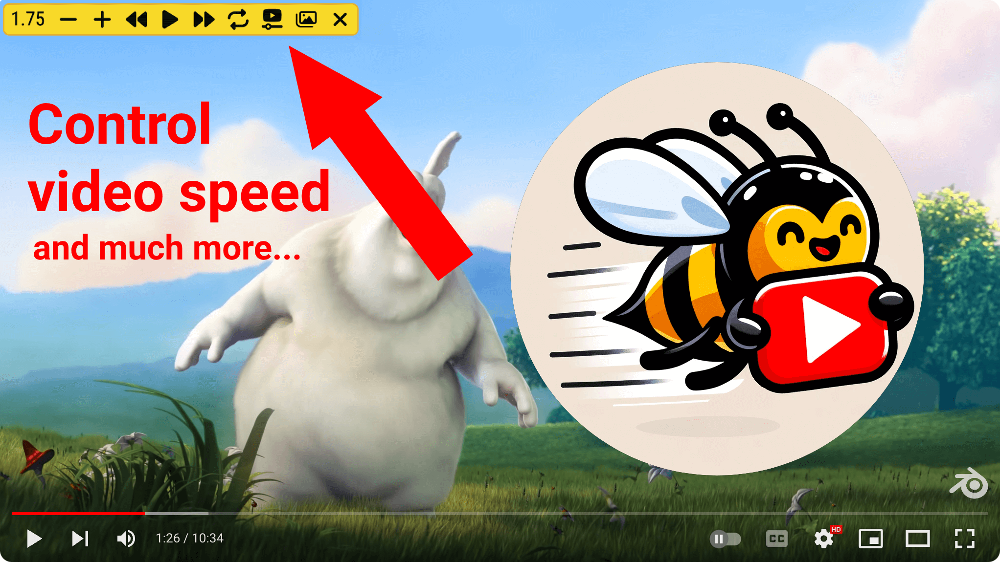
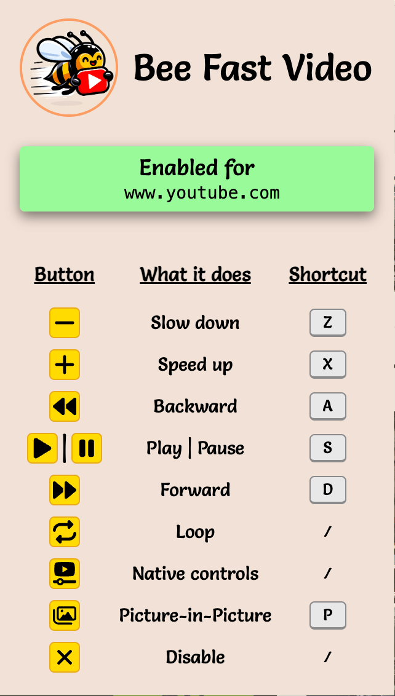

# Bee fast video

Install [here](https://chromewebstore.google.com/detail/bee-fast-video/lljkgbedmbiipekmphnhapdpfmkgbjbd)! 🐝.



**Bee fast video** is a browser extension that offers greater control over videos on all websites.

## You can



- ✅ speed up (`X`) and slow down any video (`Z`)
- ✅ seek forward (`D`) and backward (`A`) through any video
- ✅ seek video to % on any video (like on YouTube) (`0 – 9`)
- ✅ play and pause (`S`) any video
- ✅ bring to front and enable native video controls for all videos on the page (reload the page to turn off)
- ✅ toggle loop for any video
- ✅ toggle Picture-in-Picture (`P`) for any video
- ✅ disable (`B`)

## Development notes

The extension was made based on a [preact template](https://github.com/fell-lucas/chrome-extension-template-preact-vite), with most of the _extra_ stuff removed. The extension consists of the content script and a popup. These two components do not communicate in any way.

### Content script

**ControllersContainer**

Most of the important bits are located within the content script. The execution starts from `src/content/index.ts`. There, the `ControllersContainer` rendered. `ControllersContainer` initially queries all available videos, after which it keeps track of newly added/removed videos via `observeForVideoElements` mutation observer. For every video we render a `Controller` component, which receives the reference to that video element. `ControllersContainer` is intentionally rendered as an absolutely positioned, zero width and height element, in the top left corner of the page; Its purpose is to _house_ the `Controller` components, which are absolutely positioned over the top left corner of the video in respect to the `ControllersContainer`.

**Note**: The only _setting_ that the `ControllersContainer` is keeping track of is _bring-to-top and enable the native controls_. Once turned on, this setting will be applied to all videos, while being a bit _destructive_. It yanks the video from its parent and appends it to the body while trying to maintain its original position. It also forces the video controls to be turned on. The `Controller` will observe if some other actor (e.g. YouTube page) tries to turn off the native controls and turn them on as soon as this happens. 

**Controller**

The `Controller` both updates the video element based on the user actions, and keeps track of changes related to the video element. It will update its  state based on these changes. It will try to adjust its position to be on top of its video immediately (if it's possible to detect) and periodically (to cover the cases where it's not possible to easily detect such changes). The `Controller` will register listeners for keyboard shortcuts using the `keyboardListener`. It will keep track if the extension is considered _disabled_ and unregister all listeners.

### Popup

The popup is there to present functionality and shortcuts to the user. It must be manually kept in sync if either the functionality or shortcuts change.

### Styles

Styles are written in SCSS and are imported as transformed CSS `text`. This text is then used as content for the `<style>...</style>` tag. 

```typescript jsx
import cssText from "./some.scss?inline";

<style>{cssText}</style>
```
This setup circumvents issues related to processing and bundling of the styles. We want to keep the styles completely separate for the content script and the popup. Another benefit of this setup is that we don't have to declare each `.css` file in the extension manifest for the [content script](https://developer.chrome.com/docs/extensions/develop/concepts/content-scripts).

### Commands

- Dev build `npm run dev`
    - auto reload popup content on file save. You still have to manually reload the extension to observe the changes in the content script
    - enabled inlined source maps
- Prod build `npm run build`

**Note**: Both builds are effectively split in two parts, due to vite/rollup's) [limitation](https://github.com/rollup/rollup/issues/2756). Read more on this in `vite.config.ts`.

<p align=center>
  
</p>